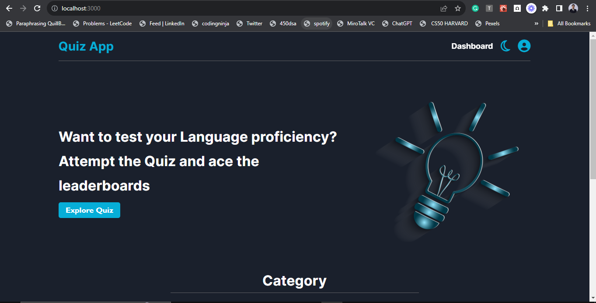
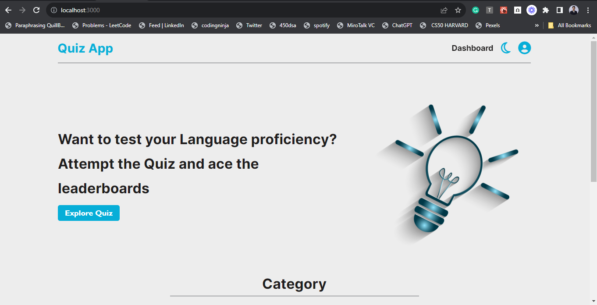
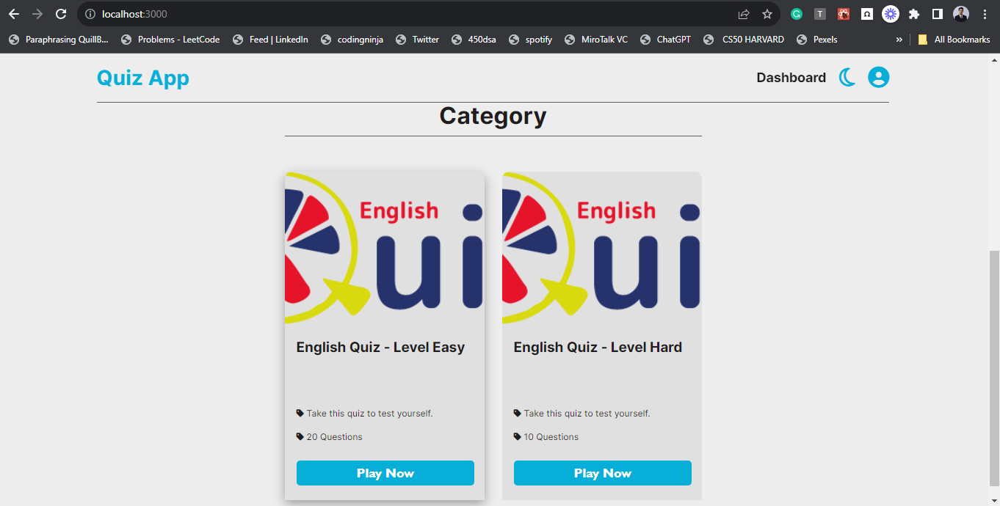
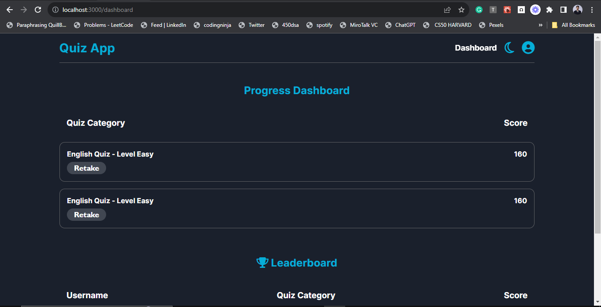
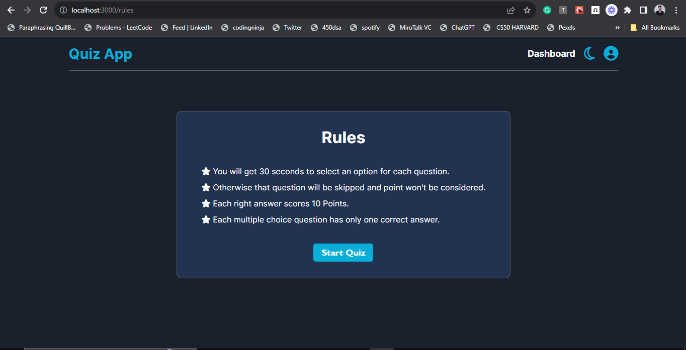
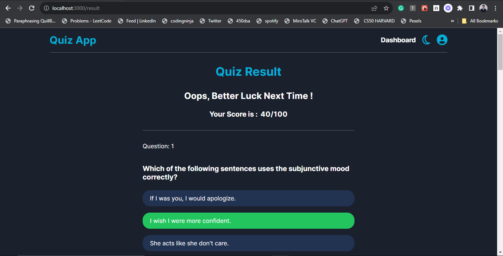
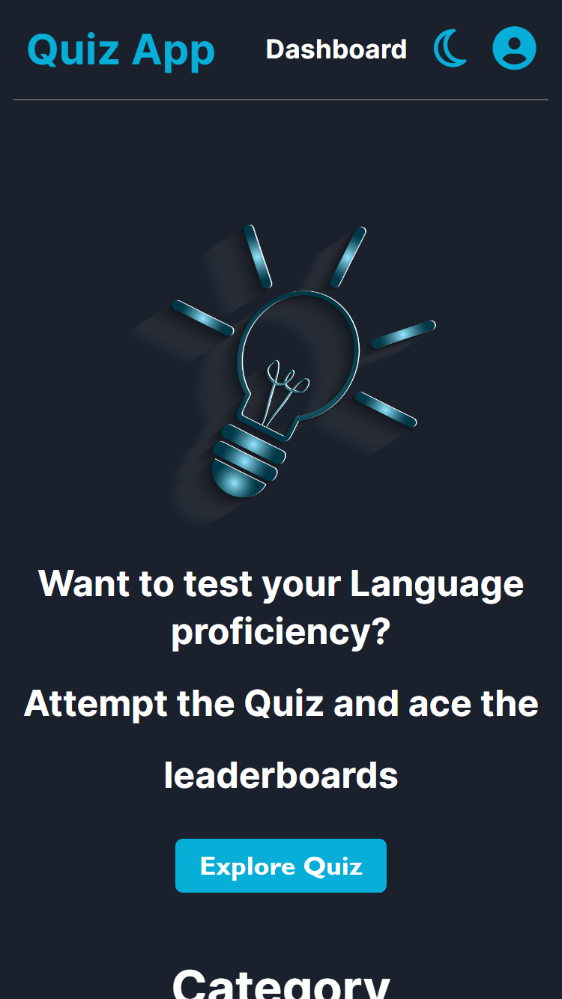

  
# Quiz App
The objective of this assignment is to create a language-learning app that
helps users improve their language proficiency through interactive exercises.


## **How to install and run locally**

```
$ git clone https://github.com/shahvezahmad/language-learning-task.git
$ cd language-learning-task
$ npm install
$ npm install firebase
$ npm start
```

## Features 

1. Home With Category
2. Authentication
      - User Signup
      - User Login
      - User Logout
3. Rules Page
4. MCQ Based Questions 
5. Quiz Result 
6. User Profile 
7. Timer for Questions
8. Leaderboard / Dashboard
9. Dark Mode / Light Mode
10. Quit Quiz
11. Full Responsive

  

## **Built with -**

- React with Typescript 
- Firebase for storing data ( user and result data )
- React Context API + useReducer
- React Router for routing different pages

## Screenshots

<div align="center">
  
</div>
<div align="center">
  
</div>
<div align="center">
  
</div>
<div align="center">
  
</div>
<div align="center">
  
</div>
<div align="center">
  
</div>
<div align="center">
  
</div>
